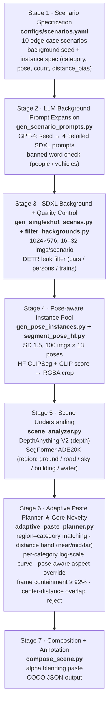

# CLAUDE.md

This file provides guidance to Claude Code (claude.ai/code) when working with code in this repository.

## Project Overview

This repo started from **X-Paste (ICML 2023)** but has been repurposed for our paper **"Scenario-aware Copy-Paste Augmentation for Military Object Detection"** (한국군사과학기술학회). We synthesize training images by composing SDXL-generated scenario backgrounds with a pose-rich SD 1.5 instance pool, using depth + segmentation to paste objects in semantically valid locations. Detection target is 3 classes — `tank`, `soldier`, `military_vehicle` — trained with YOLO11 (n/s/m) and RT-DETR.

## Pipeline (7 Stages)



Generated dataset (latest run): `output/composed_train_v2/{images,annotations.json,visualizations}`.

## Contributions

1. **Scenario-aware Background Generation (LLM 도입)** — LLM이 군사 시나리오 맥락에 맞춘 배경을 자동 생성. 단순 도시/자연 배경(X-Paste)이 아니라 전투 거리, 사막 대치, 야간 작전, 연막 전장 등 시나리오 의미가 살아있는 배경.
2. **Scene-aware Adaptive Copy-Paste** — Random paste(X-Paste)를 depth + semantic segmentation 기반 의미적 paste로 교체. 객체 카테고리에 맞는 region(soldier→ground, car→road)과 depth에 비례한 크기로 자동 배치.
3. **Pose-rich Instance Pool** — 시나리오에서 자세를 자동 추출 → 자세별 SD 생성. X-Paste의 "a photo of a single soldier" 단일 자세 대비 walking / standing / kneeling / running / prone / from-behind / facing-left / facing-right 등 풍부.
4. **Quality Control via Pretrained Detector** — SDXL 배경 leak 문제를 사전 학습 detector(DETR)로 자동 검출·제거. unlabeled-object → false-negative 학습 신호 차단.
5. **Edge-case Stress Test 시나리오** — 공간 / 규모 / 가시성 축으로 10개 challenging case 정의 (마주보는 탱크, 멀리 보이는 순찰대, 위장 군인 등).

## 시나리오 카테고리 (10개)

| # | 시나리오 | 인스턴스 자세 | 도전 |
|---|---------|--------------|------|
| 1 | 걸어오는 군인 | walking_soldier × 1 | 자세 |
| 2 | 분대 군집 | mixed_soldier × 5 | 다중 |
| 3 | 마주보는 탱크 | tank_left + tank_right | 공간 관계 |
| 4 | 탱크 종대 | tank_side × 4 | 선형 배치 |
| 5 | 호송 차량 행렬 | car_side × 6 | 다수 차량 |
| 6 | 야간 정찰 | walking_soldier × 2 | 저조도 |
| 7 | 연막 속 진격 | running_soldier × 3 | 가림 |
| 8 | 위장 군인 | prone_soldier × 1 | 배경 융합 |
| 9 | 멀리 보이는 순찰대 | walking_soldier × 4 (소형) | 소형 객체 |
| 10 | 지평선의 탱크 | tank × 2 (소형) | 소형 객체 |

## 실험 설계 (6 exps × 3 models = 18 runs)

**카테고리**: tank · soldier · military_vehicle
**모델**: YOLOv8 · YOLO11 (n/s/m) · RT-DETR
**평가**: mAP + AP_small/medium/large + 카테고리별 AP

| Exp | Train | 평가 |
|-----|-------|------|
| Exp-1 | 실제 데이터 only | 실제 testset (baseline) |
| Exp-2 | X-Paste random paste (기존) | 실제 testset |
| Exp-3 | SDXL single-shot only (객체까지 SDXL) | 실제 testset |
| Exp-4 | SDXL 시나리오 배경 + random paste | 실제 testset |
| Exp-5 | **SDXL 시나리오 배경 + scene-aware paste (제안)** | 실제 testset |
| Exp-6 | Exp-5 + 실제 데이터 혼합 | 실제 testset |

핵심 비교: Exp-2 vs Exp-5 (scene-aware 효과), Exp-3 vs Exp-5 (single-shot vs 우리), Exp-4 vs Exp-5 (paste 방식 ablation), Exp-6 vs Exp-1 (보강 효과).

## Dataset Layout

```
data/
├── roboflow_soldier_raw/soldier.v1i.yolov11/{train,valid,test}/{images,labels}   # raw Roboflow (12 class)
└── military_yolo/
    ├── real/{train,valid,test}/{images,labels}    # remapped to 3-class (tools/remap_roboflow_labels.py)
    └── synth/{train,val}/{images,labels}          # synthesized via 7-stage pipeline
output/composed_train_v2/                          # 가장 최근 합성 출력 (COCO JSON + images + viz)
```

YOLO data config: `configs/military.yaml`
```yaml
path: /workspace/XPaste/data/military_yolo
train: synth/train/images
val:   synth/val/images
test:  real/test/images
names: { 0: tank, 1: soldier, 2: military_vehicle }
```

## 신규 파이프라인 스크립트 (요약)

| 파일 | 역할 |
|------|------|
| `configs/scenarios.yaml` | 10개 시나리오 정의 |
| `generation/gen_scenario_prompts.py` | GPT-4로 SDXL 배경 프롬프트 확장 + 캐시 |
| `generation/gen_singleshot_scenes.py` | SDXL 1024×576 배경 생성 |
| `generation/filter_backgrounds.py` | DETR로 leak 객체 자동 검출·제거 |
| `generation/gen_pose_instances.py` | SD 1.5 자세별 인스턴스 생성 |
| `generation/segment_pose_hf.py` | HF CLIPSeg + CLIP 필터 + RGBA crop |
| `generation/scene_analyzer.py` | DepthAnything-V2 + SegFormer ADE20K |
| `generation/adaptive_paste_planner.py` | depth/seg 기반 paste 위치·크기 결정 |
| `generation/compose_scene.py` | 통합 파이프라인 + COCO JSON 출력 |
| `tools/remap_roboflow_labels.py` | Roboflow 12-class → 우리 3-class YOLO |
| `tools/coco_to_yolo.py` | COCO JSON → YOLO txt 변환 |

## Commands

```bash
# Generate scenario backgrounds + instance pool + composed dataset (Stages 2-7)
python generation/gen_scenario_prompts.py    --scenarios configs/scenarios.yaml
python generation/gen_singleshot_scenes.py   --scenarios configs/scenarios.yaml --out output/bg
python generation/filter_backgrounds.py      --in output/bg --out output/bg_clean
python generation/gen_pose_instances.py      --out output/instances
python generation/segment_pose_hf.py         --in output/instances --out output/instances_rgba
python generation/compose_scene.py           --bg output/bg_clean --inst output/instances_rgba \
                                             --out output/composed_train_v2

# Convert composed COCO JSON → YOLO format for training
python tools/coco_to_yolo.py --coco output/composed_train_v2/annotations.json \
                              --images output/composed_train_v2/images \
                              --out data/military_yolo/synth

# Remap Roboflow real test set to our 3 classes
python tools/remap_roboflow_labels.py \
  --input_root data/roboflow_soldier_raw/soldier.v1i.yolov11 \
  --output_root data/military_yolo/real

# Train YOLO11 (n / s / m) — needs ultralytics installed
pip install ultralytics
yolo detect train data=configs/military.yaml model=yolo11n.pt epochs=100 imgsz=640 project=runs/military name=yolo11n
yolo detect train data=configs/military.yaml model=yolo11s.pt epochs=100 imgsz=640 project=runs/military name=yolo11s
yolo detect train data=configs/military.yaml model=yolo11m.pt epochs=100 imgsz=640 project=runs/military name=yolo11m
```

## Reused from Original X-Paste

- `generation/text2im.py` — SD 1.5 text-to-image base (자세별 인스턴스 생성에서 `--prompt_template` 활용)
- `segment_methods/reseg.py` + `clean_pool.py` — 인스턴스 마스크 생성 / 필터링
- `xpaste/data/transforms/custom_cp_method.py` — alpha / poisson blending (compose_scene에서 호출)

## Plan File

세부 단계 및 알고리즘은 `/Users/kyu216/.claude/plans/rosy-splashing-whistle.md` 참조.
