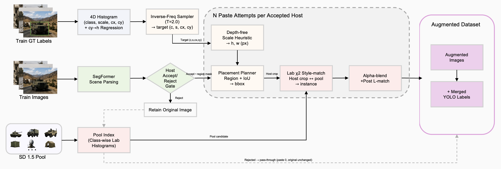

<div align="center">

# Distribution-aware Generative Copy-Paste for Military Object Detection

**생성 AI 기반 군사 합성 데이터 생성 및 객체 탐지 성능 검증**

Byungkyu Kim · Sungju An · Siwoo Kim · Jhonghyun An†

Department of AI-Software, Gachon University

*2026 KIMST Annual Conference (한국군사과학기술학회 종합학술대회)*

[](#-citation)
[](https://www.python.org/)
[](https://pytorch.org/)
[-555.svg)](https://arxiv.org/abs/2212.03863)
[](#-license)

</div>

---

## 📌 Overview

Military object detection suffers from **severe data scarcity** and **long-tailed
distributions** across class, scale, and spatial location. Conventional Copy-Paste increases
object diversity but samples class / scale / location **uniformly**, so it faithfully preserves
the original distribution bias instead of correcting it.

We propose a **distribution-aware Copy-Paste pipeline** built upon
[X-Paste (ICML 2023)](https://arxiv.org/abs/2212.03863). Rather than generating backgrounds,
we paste **Stable Diffusion 1.5–generated instances** onto real training images and actively
bias the paste configuration toward the **under-represented bins** of the host dataset's
empirical distribution — controlling a **4D joint distribution (class × scale × cx × cy)**
via inverse-frequency sampling, with style-matched instance selection and a depth-free scale
heuristic to keep compositions realistic. No architectural changes to the detector are required.

> **TL;DR** — Inverse-frequency 4D distribution control improves YOLO11-m by **+2.3 mAP@0.5**
> in-distribution (90.2 → 92.5) and **+3.3 mAP@0.5** out-of-distribution (34.7 → 38.0).
> The gain is largest under domain shift, confirming better generalization.

### ✨ Highlights
- 🎯 **Inverse-frequency 4D sampling** over (class × scale × cx × cy) reinforces rare bins (`T = 2.0`).
- 🎨 **Style-matched instance selection** via Lab χ² histogram distance + L-channel correction.
- 📐 **Depth-free scale heuristic** — robust to camouflage / smoke / atypical military scenes.
- 🗺️ **Scene-aware synthesis** — SegFormer (ADE20K) ground/road constraints keep pastes plausible.
- 🚀 Plug-and-play with **YOLO11 (n / s / m)** — no architecture changes required.

---

## 🎬 Pipeline Tour

<div align="center">

<video src="https://github.com/bk11052/X-Paste-for-Object-Detection/raw/main/assets/pipeline_tour.mp4" autoplay loop muted playsinline controls width="100%"></video>

▶ If the video does not play inline, open it directly: [assets/pipeline_tour.mp4](assets/pipeline_tour.mp4)

</div>

---

## 📊 Results

YOLO11-m on the in-distribution (ID) test set and an out-of-distribution (OOD) military set
(paper, Table 1). `Δ` is measured against the Real-only baseline (A).

| Method | ID mAP@0.5 | ID mAP@0.5:0.95 | OOD mAP@0.5 | OOD mAP@0.5:0.95 |
|:------|:----------:|:---------------:|:-----------:|:----------------:|
| Real-only (A) | 90.2 | 74.4 | 34.7 | 22.1 |
| Copy-Paste (B) | 91.0 | 75.3 | 34.7 | 22.7 |
| SD random (C) | 91.2 | 76.3 | 35.5 | 23.5 |
| Scene-aware (D) | 91.8 | 75.6 | 34.4 | 22.4 |
| **Ours (E)** | **92.5** | **76.8** | **38.0** | **24.0** |
| _Δ vs. A_ | _+2.3_ | _+2.4_ | _+3.3_ | _+1.9_ |

The proposed method (E) achieves the best ID **and** OOD performance across all comparison
settings. The improvement is most pronounced under domain shift (OOD), confirming the
effectiveness of inverse-frequency distribution control for generalization — **without**
degrading in-distribution accuracy.

---

## 🧩 Method

<div align="center">

</div>

The pipeline couples (i) a **distribution sampler** that decides *what* to paste, *where*,
and at *what scale*, with (ii) a **style-matching module** that decides *how* to blend it
naturally. A 4D class / scale / (cx, cy) joint distribution estimated from the GT is inverted by
inverse-frequency to reinforce rare bins; the selected synthetic instance is matched to the host
crop by Lab χ² distance, constrained to plausible regions by SegFormer scene parsing, and
L-channel corrected before being alpha-blended into the training image.

1. **Inverse-frequency sampling** — A 4D histogram `P(c, s, x, y)` of (class, scale_bin, cx_bin, cy_bin)
   is estimated from the training GT, each axis discretized into 4 bins. Sampling weights are
   `w(c, s, x, y) ∝ (P(c, s, x, y) + ε)^(-1/T)`, giving larger weight to rarer cells.
   `T = 2.0` balances head preservation and tail reinforcement.
2. **Style-matched instance selection** — Per-channel 32-bin Lab histograms are compared by
   χ² distance between the host crop and candidate instances; the top `k = 8` are kept and
   distance-weighted sampled. After pasting, the L-channel mean difference is corrected with the
   shift capped at 20 to preserve the object's intrinsic shading.
3. **Depth-free scale heuristic** — Monocular depth is unreliable in camouflaged / smoke / atypical
   military scenes, so scale is decided by a 3-step fallback using only the dataset's own statistics:
   (i) same-class GT anchor → (ii) `cy → h` linear regression → (iii) scale-bin center.
4. **Scene-aware synthesis** — SegFormer (ADE20K) region constraints (ground / road) keep pastes in
   plausible locations, with frame containment and overlap rejection.

---

## 🗂️ Dataset

- **In-distribution** — Roboflow *Custom Object Detection – Military* (1,934 images, 4 classes:
  `Soldier`, `civilian_vehicle`, `military_vehicle`, `persons`).
- **Out-of-distribution** — a separate Roboflow military set remapped to the same 4 classes
  (same domain, different dataset).
- Trained with **YOLO11 (n / s / m)** × 3 seeds.

Class config (`configs/military_4cls.yaml`):

```yaml
names: { 0: Soldier, 1: civilian_vehicle, 2: military_vehicle, 3: persons }
```

---

## ⚙️ Installation

```bash
pip install -r requirements.txt
# or build the provided image
docker build -t xpaste .
docker run --gpus all -it --rm -v $(pwd):/workspace/XPaste xpaste bash
```

This project builds on [X-Paste](https://github.com/yoctta/XPaste); see its documentation for
detailed environment setup (PyTorch, CUDA, Stable Diffusion weights).

---

## 🚀 Getting Started

### 1. Generate the SD 1.5 instance pool

```bash
python generation/gen_pose_instances.py \
  --scenarios configs/instance_poses_4cls.yaml \
  --output_dir output/pool_v1/raw --samples 30 --image_size 512 --steps 30 --guidance 7.5
python segment_methods/segment_pose_hf.py \
  --input_dir output/pool_v1/raw --output_dir output/pool_v1/rgba
python tools/filter_pool_by_clip_margin.py \
  --in output/pool_v1/rgba --out output/pool_v1/rgba_filtered \
  --margin 0.10 --pairs "Soldier:civilian persons:soldier_uniform"
```

### 2. Build the distribution and pool index

```bash
python -m xpaste.aug.distribution \
  --labels_dir data/military_v1/real/train/labels --out cache/dist_v1.json
python -m xpaste.aug.style_match \
  --pool_dir output/pool_v1/rgba_filtered --out cache/pool_index_v1.npz
```

### 3. Build the distribution-aware augmented dataset

```bash
python -m xpaste.aug.build_augmented \
  --host_root data/military_v1/real/train \
  --pool_dir output/pool_v1/rgba_filtered --pool_index cache/pool_index_v1.npz \
  --hist cache/dist_v1.json \
  --paste_mode style_full --pastes_per_image 3 --temperature 2.0 \
  --out_root data/military_v1/aug_E/train --save_meta --seed 0
```

`paste_mode` selects the ablation: `real_random`, `pool_random`, `scene_uniform`, or
`style_full` (proposed).

### 4. Train and evaluate

```bash
# YOLO11 n/s/m x seeds (in-distribution)
EXPS="A E" MODELS="yolo11n yolo11s yolo11m" SEEDS="0 1 2" bash tools/run_yolo_matrix.sh
# OOD evaluation
DEVICE=0 bash tools/eval_on_ood.sh
```

---

## 📁 Repository Structure

```
.
├── xpaste/aug/          # distribution sampler, host-scene parsing, scale heuristic,
│                        # style matching, and the offline augmented-dataset builder
├── generation/          # SD 1.5 instance generation + SegFormer scene analyzer
├── segment_methods/     # HuggingFace CLIPSeg → RGBA instance segmentation
├── tools/               # data prep, leakage check, OOD builders, YOLO/eval drivers
├── configs/             # 4-class YOLO data configs, instance pose specs, OOD mappings
└── assets/              # figures and the pipeline tour video used in this README
```

---

## 📝 Citation

```bibtex
@inproceedings{Kim2026MilitarySynthetic,
  title     = {Generation of Military Synthetic Data Using Generative AI and Validation of Object Detection Performance},
  author    = {Kim, Byungkyu and An, Sungju and Kim, Siwoo and An, Jhonghyun},
  booktitle = {Proc. Korea Institute of Military Science and Technology (KIMST) Annual Conference},
  year      = {2026}
}
```

```bibtex
@inproceedings{Zhao2022XPasteRC,
  title     = {X-Paste: Revisiting Scalable Copy-Paste for Instance Segmentation using CLIP and StableDiffusion},
  author    = {Zhao, Hanqing and Sheng, Dianmo and Bao, Jianmin and Chen, Dongdong and Chen, Dong and Wen, Fang and Yuan, Lu and Liu, Ce and Zhou, Wenbo and Chu, Qi and Zhang, Weiming and Yu, Nenghai},
  booktitle = {International Conference on Machine Learning (ICML)},
  year      = {2023}
}
```

---

## 🙏 Acknowledgements

This work was supported by the **Civil-Military Technology Cooperation Program** funded by the
Korean Government (Ministry of Trade, Industry and Energy & Defense Acquisition Program
Administration), project No. 202509910002 (25-PD-EL-01).

Built upon **[X-Paste](https://github.com/yoctta/XPaste)** (ICML 2023), and uses
[Stable Diffusion](https://github.com/CompVis/stable-diffusion),
[CLIP](https://github.com/openai/CLIP),
[CLIPSeg](https://github.com/timojl/clipseg),
[SegFormer](https://github.com/NVlabs/SegFormer), and
[Ultralytics YOLO11](https://github.com/ultralytics/ultralytics).

---

## 📄 License

The majority of this project is licensed under the **Apache 2.0** license. Portions are available
under separate terms: CLIP, CLIPSeg, and SegFormer are under the MIT license; Stable Diffusion is
under the CreativeML Open RAIL-M license. If you add third-party code, please keep this license
information updated.
