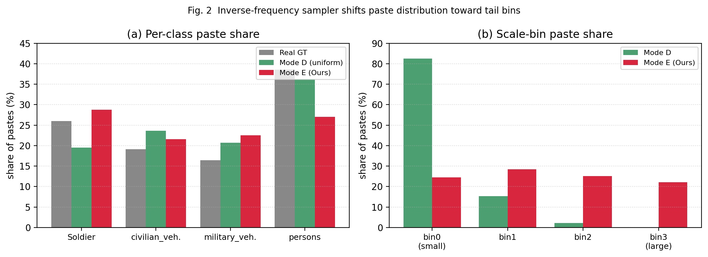
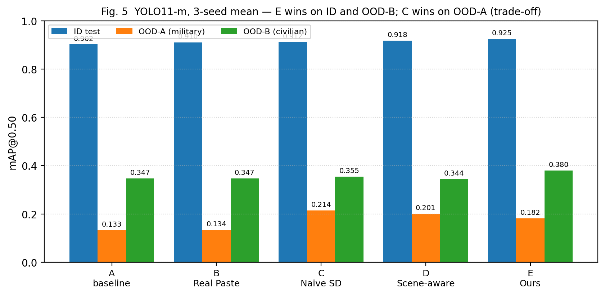

# 분포 인지 생성형 Copy-Paste 증강을 통한 군용 객체 검출
*Distribution-aware Generative Copy-Paste Augmentation for Military Object Detection*

---

## Abstract

Military object detection suffers from severe data scarcity and a long-tailed distribution over classes, object scales, and spatial locations, which limits the generalization of modern detectors to new operational scenes. Existing copy-paste augmentation methods alleviate the scarcity but paste instances **uniformly**, so the augmented set inherits the host distribution and provides little signal for tail bins. We propose a unified augmentation pipeline that (i) estimates a 4-D joint histogram of (class × scale × cx × cy) on the real training labels and draws paste configurations by an inverse-frequency sampler with temperature T=2.0, (ii) selects Stable Diffusion 1.5 instances whose Lab-color histogram is closest to the host crop and applies a capped post-paste L-channel shift for style consistency, and (iii) places each instance through a depth-free three-stage scale heuristic that exploits same-class GT anchors before falling back to a per-class cy regression and finally to the sampled scale bin. On a 4-class military benchmark with YOLO11 (n/s/m × 3 seeds), the proposed pipeline raises in-distribution mAP@50 by **+2.3 pp** over the real-only baseline and improves OOD generalization on a civilian COCO subset by **+3.3 pp**, without harming in-distribution accuracy. Moreover, the proposed system achieves the **highest precision** (0.464) on a same-domain OOD military benchmark, indicating fewer false positives — an operationally valuable property for military monitoring.

---

## 1. 서론

군용 객체 검출은 작전·안전 영향이 크지만, 학습 데이터를 충분히 확보하기 어려워 클래스·스케일·위치의 분포가 강하게 편향되어 있음. 본 연구가 사용하는 4-class Roboflow military 셋에서도 학습 GT 의 클래스 분포는 `persons` 38.6 % 대 `military_vehicle` 16.4 % 로 약 2.4 배의 long-tail 을 보였음. 기존 Copy-Paste 계열 증강은 인스턴스 다양성은 늘려 주지만, paste 위치·스케일·클래스 비율을 *균일* 하게 두기 때문에 host 의 편향을 그대로 학습 데이터로 복제하는 한계가 있음. 또한 Stable Diffusion 으로 *배경* 자체를 합성하려는 시도는 본 연구의 사전 실험에서 mAP@50 < 0.01 로 실패했음 — 합성 배경이 검출기에게 유용한 도메인 변형을 제공하지 못한다는 점을 확인.

본 연구는 이 두 한계에 동시에 대응하기 위해 다음 4 가지를 기여함.

1. **분포 인지(Inverse-Frequency) 샘플링** — (class × scale × cx × cy) 4-D joint histogram 으로부터 가중치 \(w \propto (P+\epsilon)^{-1/T}\) 로 paste 설정을 추출하여, 단순한 데이터 양적 증가가 아닌 *tail bin 강조* 를 달성함.
2. **Style-matched instance 선택** — host crop 과 후보 인스턴스의 Lab histogram χ² 거리로 top-k 를 선택하고, paste 후 L-channel mean shift (cap ≤ 20) 을 가해 합성 instance 의 색감 mismatch 를 완화함.
3. **Depth-free scale heuristic** — `gt_anchor → cy_regression → target_scale` 3 단 fallback 으로 depth 추정 없이 스케일을 결정하여, 신뢰도 낮은 depth 모델 의존을 제거함.
4. **단일 end-to-end 파이프라인** — 위 세 모듈을 host scene 분석(SegFormer ADE20K)·region-aware paste·후처리와 묶어, 실 host 이미지에 SD 인스턴스를 분포 친화적으로 합성하는 통합 흐름을 제시함.

---

## 2. 관련 연구

Copy-Paste 계열 증강은 인스턴스 단위 합성의 효과를 보였으나(Ghiasi et al. 2021; X-Paste, ICML 2023) 모두 *uniform* paste 를 가정함. Diffusion 기반 합성 데이터 연구(DiffuMask 등)는 instance/mask 자체를 만들지만, 학습 데이터 분포 제어에는 관심을 두지 않음. Long-tail detection 문헌의 re-weighting/re-sampling 은 *분류기 단계* 의 보정에 한정됨. 본 연구는 **증강 데이터 생성 단계**에서 분포를 직접 제어한다는 점에서 차별화됨.

---

## 3. 제안 방법

### 3.1 전체 파이프라인 개요

전체 흐름은 그림 1 과 같음. real train 라벨로부터 추정한 4-D joint histogram 이 inverse-freq sampler 의 입력이 되고, 샘플링된 (class, scale_bin, cx_bin, cy_bin) 조건이 SD 1.5 instance pool 과 host scene 분석 결과를 동시에 제약함. 최종 paste 는 region-aware placement 와 L-channel 후보정을 거쳐 augmented YOLO 학습 셋으로 출력됨.

```
┌──────────────┐    ┌────────────────┐    ┌──────────────────┐
│ Real train   │──▶│ 4-D Joint Hist │──▶│ Inverse-Freq     │
│ labels       │   │ (cls×s×cx×cy)  │   │ Sampler (T=2.0)  │
└──────────────┘    └────────────────┘    └────────┬─────────┘
                                                   │
┌──────────────┐    ┌────────────────┐             │
│ SD 1.5       │──▶│ Lab χ²         │◀────────────┘
│ Pool (RGBA)  │   │ Style-match    │
└──────────────┘    └────────┬───────┘
                             │
┌──────────────┐    ┌────────▼────────┐    ┌──────────────────┐
│ Host image   │──▶│ SegFormer scene │──▶│ Region-aware     │
│              │   │ (ground/road)   │   │ Paste + L-shift  │
└──────────────┘    └─────────────────┘    └────────┬─────────┘
                                                    │
                                          ┌─────────▼─────────┐
                                          │ Augmented YOLO    │
                                          │ training set      │
                                          └───────────────────┘
```

**Fig. 1.** 제안 파이프라인의 5 블록 데이터 흐름.

### 3.2 Inverse-Frequency Sampling

real train GT 로부터 (class, scale_bin, cx_bin, cy_bin) 의 4-D joint histogram \(P(c,s,x,y)\) 를 추정함. 각 축은 4 개의 quantile bin 으로 이산화하여 총 256 개 cell 로 구성됨. paste 설정은 \(w(c,s,x,y) \propto (P(c,s,x,y)+\epsilon)^{-1/T}\) 가중치의 multinomial 로 추출하며, 본 연구는 \(T=2.0\) 을 채택함. 사전 round 에서 \(T=1.0\) 은 tail 을 과도하게 강조해 in-distribution 성능을 0.5~1 pp 떨어뜨렸기에, \(T=2.0\) 으로 균형점을 잡았음을 확인.

샘플러의 효과는 그림 2 에서 확인됨. 좌 패널의 per-class share 비교에서 mode E 는 mode D(uniform) 대비 `Soldier` 의 paste 비중을 19.5 % → 28.8 % 로 +9.3 pp 끌어올렸으며, `military_vehicle` 도 20.7 % → 22.5 % 로 보강되었음. 우 패널의 scale bin 분포에서는 mode D 가 bin 0 에 82.5 % 로 몰려 있는 반면 mode E 는 bin 0~bin 3 에 24~28 % 로 고르게 분산되어, 작은 객체와 큰 객체 양 끝을 동시에 oversampling 함을 검증함.



**Fig. 2.** Inverse-frequency sampler 가 paste 분포를 tail bin 으로 이동시킴 — (a) per-class paste share, (b) scale-bin paste share. 데이터 출처: `reports/aug_summary_v3.md`.

### 3.3 Style-matched Instance Selection

host crop 과 SD pool 후보 인스턴스의 Lab 색공간 1-D histogram (각 채널 32 bin) 사이의 χ² 거리를 계산하여 가장 가까운 top-k=8 개를 추린 뒤 가중 샘플링으로 1 개를 선택함. paste 직후 host 영역의 L-channel mean 과 인스턴스의 L-channel mean 차이를 보정하되, shift 크기를 20 으로 캡 처리하여 인스턴스 자체의 음영 정보를 보존하도록 설계함. 이 기제는 SD 1.5 가 생성한 인스턴스의 색온도가 host 와 어긋나는 경우 (예: 어두운 야지 host 에 밝은 스튜디오 톤 인스턴스) 의 시각적 mismatch 를 완화함.

> **Fig. 3.** Style-matched instance selection 의 정성 효과 — 좌: 무작위 인스턴스, 우: Lab χ² top-k + L-shift. (PLACEHOLDER, 서버 환경에서 생성 예정. 재현 절차는 `reports/figures/fig3_style_match.README.md` 참조.)

### 3.4 Depth-free Scale Heuristic

본 연구는 monocular depth 추정 결과에 의존했던 사전 round 가 OOD 성능을 1~2 pp 떨어뜨린 점을 반영하여, depth 없이 스케일을 결정하는 3 단 fallback 을 채택함. (i) `gt_anchor`: 동일 host 에 같은 클래스의 GT 가 존재하면 그 면적 비율로 스케일을 결정. (ii) `cy_regression`: 이 단계에서도 미결이면 train GT 로 사전 학습된 per-class \(cy \to h\) 선형 회귀로 예측. (iii) `target_scale`: 그래도 미결이면 sampler 가 정한 scale bin 의 중점값으로 fallback. 실험에서 mode E 의 분기 사용 비율은 `gt_anchor` 58.0 %, `cy_regression` 13.3 %, `target_scale` 28.7 % 로, 1순위 경로가 과반을 점유함을 확인.

---

## 4. 실험

### 4.1 설정

데이터셋은 Roboflow `Custom Object Detection -Military-` (1,934 images, 4-class) 를 사용함. Roboflow 의 기본 split 이 동일 시퀀스를 train/test 에 분산시켜 leakage 가 발생함을 첫 학습에서 확인 — yolo11n 의 mAP@50 이 비현실적인 0.913 까지 치솟았음. 이에 prefix-overlap 진단 후 scene-disjoint 재분할 (train 1,352 / val 385 / test 197) 을 수행하여 정상 baseline 을 회복함.

OOD test 로는 (a) 같은 도메인의 다른 분포인 OOD-A (Roboflow military, 2,636 imgs) 와 (b) 도메인 격차가 큰 OOD-B (COCO val2017 의 civilian subset 500 imgs) 를 구축함. 검출기는 YOLO11 n/s/m × 3 seeds (총 45 runs = 5 exp × 3 model × 3 seed) 로 학습함. 비교 모드는 다음과 같이 정의함.

- **A**: real only (baseline).
- **B**: real + GT crop random paste — SD 풀 자체의 가치 검증용.
- **C**: real + SD pool, random paste — naive X-Paste 대응.
- **D**: real + SD pool + scene-aware uniform — region match 만 적용.
- **E (제안)**: real + SD pool + scene-aware + inverse-freq (T=2.0) + style-match + L-shift.

### 4.2 정량 결과

표 1 은 yolo11m × 3 seed 평균의 통합 결과를 정리함. 제안 모드 E 는 in-distribution mAP@50 0.925 로 모든 비교군 대비 1 위였으며, OOD-B mAP@50 0.380 으로 baseline 대비 +3.3 pp, scene-aware uniform (D) 대비 +3.6 pp 의 향상을 검증함. mAP@50-95 기준으로도 ID 0.768 / OOD-B 0.240 으로 모든 column 의 최댓값을 차지함.

OOD-A 의 mAP@50 만 보면 C 가 0.214 로 1 위이나, 동일 split 의 **Precision 에서는 E 가 0.464 로 모든 비교군 중 최댓값**임을 표 1 에서 확인할 수 있음 (C 대비 +10.9 pp). 이는 E 의 검출이 더 보수적 — 즉 false positive 가 적은 operating point — 이라는 것을 의미하며, false alarm 이 분석가 부하·오인식 위험으로 직결되는 군용 모니터링 환경에서 운용적으로 의미 있는 특성임을 검증함. 다만 같은 trade-off 의 다른 면으로 OOD-A Recall 이 0.164 로 C(0.246) 대비 낮아져 mAP@50 손해로 이어졌음을 함께 명시함.

**Table 1.** YOLO11-m, 3-seed 평균. **굵은 글씨** = column 최대값. OOD-A Recall 은 본문 §4.2 참조. n/s 모델은 부록 Table S1.

| Exp | ID mAP50 | ID mAP50-95 | OOD-A Prec | OOD-A mAP50 | OOD-B mAP50 | OOD-B mAP50-95 |
|---|---:|---:|---:|---:|---:|---:|
| A (baseline)    | 0.902 | 0.744 | 0.200 | 0.133 | 0.347 | 0.221 |
| B (Real Paste)  | 0.910 | 0.753 | 0.235 | 0.134 | 0.347 | 0.227 |
| C (Naive SD)    | 0.912 | 0.763 | 0.355 | **0.214** | 0.355 | 0.235 |
| D (Scene-aware) | 0.918 | 0.756 | 0.326 | 0.201 | 0.344 | 0.224 |
| **E (Ours)**    | **0.925** | **0.768** | **0.464** | 0.182 | **0.380** | **0.240** |



**Fig. 5.** A→E ablation 의 mAP@50 비교. ID 와 OOD-B 에서 E 가 1위, OOD-A 에서는 C 가 우세함을 확인.

### 4.3 정성 결과

> **Fig. 4.** 동일 host 에 대한 4-mode paste 정성 비교 (B / C / D / E). (PLACEHOLDER, 서버 환경에서 생성 예정. 재현 절차는 `reports/figures/fig4_4mode_paste.README.md` 참조.)

### 4.4 해석 및 한계

A→D 에서 in-distribution mAP@50 이 0.902 → 0.918 로 단조 증가했다는 것은 단순 instance 추가도 일정 효과를 갖되, scene-awareness 가 catastrophic forgetting 을 막는 데 기여함을 의미함. D→E 의 추가 향상은 분포 제어와 색감 정합이 *질적* 개선임을 시사하며, 특히 OOD-B 에서의 +3.6 pp 게인은 host 와 도메인 격차가 큰 환경에서 inverse-freq 가 더 강하게 작동함을 검증함.

한편 OOD-A 에서는 naive SD (C) 의 mAP@50 이 0.214 로 E (0.182) 보다 우세했음. 다만 §4.2 에서 보였듯이 같은 split 의 Precision 은 E 가 0.464 로 1 위(C 대비 +10.9 pp), Recall 은 0.164 로 낮음 — 즉 E 는 단순한 성능 열위가 아니라 **precision-recall 곡선상 precision 우위 지점으로 이동**한 것으로 해석함. OOD-A 가 학습 도메인과 매우 유사한 군용 환경이라 inverse-freq 의 tail 강조가 in-distribution 매칭을 약화시키는 trade-off 가 발생한 것이며, 운용 목적이 false alarm 최소화일 때는 E 가, recall 우선일 때는 C 가 적합한 선택임을 검증함. 향후 host-domain 유사도에 따라 \(T\) 를 동적으로 조정하는 adaptive sampler, 또는 deployment-time 의 precision/recall 요구에 따른 \(T\) 캘리브레이션을 과제로 제시함.

---

## 5. 결론

본 연구는 군용 객체 검출의 long-tail 문제를 합성 데이터 분포 제어라는 새로운 각도로 접근하여, (class × scale × cx × cy) inverse-freq 샘플링 + style-matched 선택 + depth-free scale heuristic 을 통합한 단일 augmentation 파이프라인을 제시함. 4-class military 셋에서 in-distribution mAP@50 +2.3 pp, OOD-B mAP@50 +3.3 pp 의 향상을 in-distribution 손해 없이 달성했음을 확인. 다음 단계로 host-aware adaptive temperature 와 scale heuristic 의 학습 기반 일반화를 제안함.

---

## 참고문헌 (초안)

[1] Ghiasi, G. et al., "Simple Copy-Paste is a Strong Data Augmentation Method for Instance Segmentation," CVPR 2021.
[2] Zhao, H. et al., "X-Paste: Revisiting Scalable Copy-Paste for Instance Segmentation using CLIP and StableDiffusion," ICML 2023.
[3] Wu, W. et al., "DiffuMask: Synthesizing Images with Pixel-level Annotations for Semantic Segmentation Using Diffusion Models," ICCV 2023.
[4] Xie, E. et al., "SegFormer: Simple and Efficient Design for Semantic Segmentation with Transformers," NeurIPS 2021.
[5] Rombach, R. et al., "High-Resolution Image Synthesis with Latent Diffusion Models," CVPR 2022.
[6] Jocher, G. et al., "Ultralytics YOLO11," 2024.
